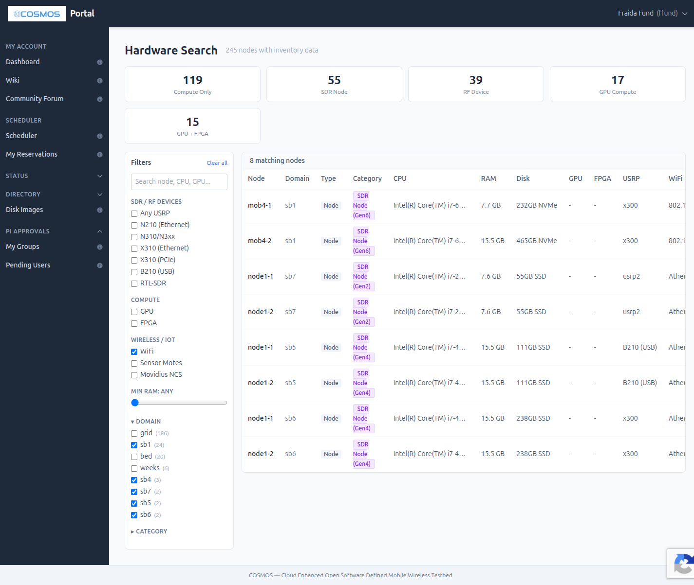
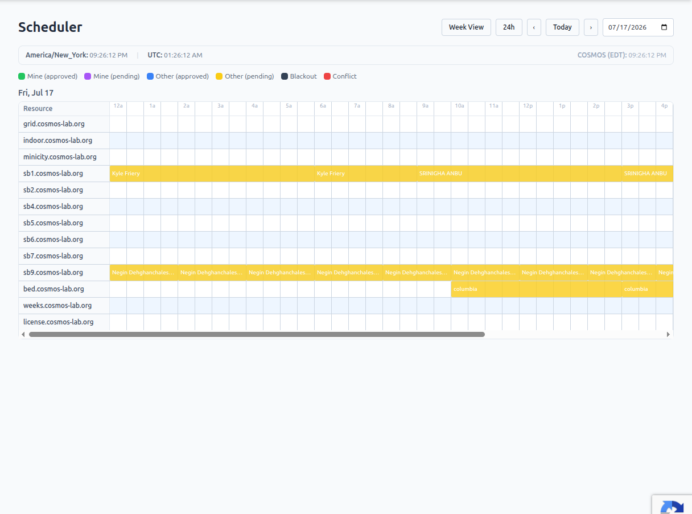
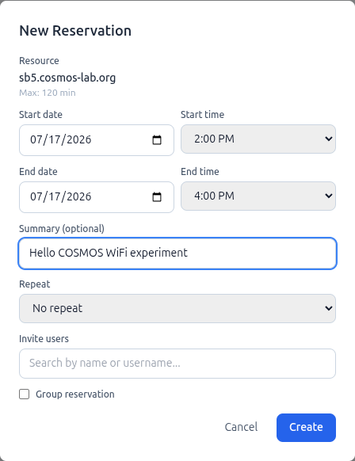

## Start an experiment

Now, you are ready to run an experiment on COSMOS!

COSMOS resources are organized into **domains**. Each domain is an isolated environment with its own console, nodes, and control network. COSMOS has several kinds of domains:

* **Top-tier testbeds** support large-scale experiments. These include the outdoor `bed` domain in West Harlem and the indoor `grid` domain at WINLAB. We will not use the grid for this experiment; it is reserved for experiments that need its large-scale deployment.
* **Sandboxes** are small, isolated environments, typically with two nodes and a console. Each sandbox has different radios, compute resources, and other devices. Sandboxes are intended for developing and debugging an experiment before you scale it to a larger testbed.
* **Specialized domains** support work such as outdoor, model-intersection, and private 5G experiments.

You can read more about these environments in the [COSMOS domains guide](https://www.cosmos-lab.org/en/wiki/public/hardware/domains).

In this "Hello, COSMOS" experiment, you will use two nodes in a sandbox to run a basic WiFi experiment. First, you will use the COSMOS Hardware Search to find the sandboxes whose nodes have WiFi interfaces.

### Find a sandbox with WiFi

Log in to the [COSMOS portal](https://www.cosmos-lab.org/portal/), then:

1. Open "Status" in the navigation menu and select "Hardware Search".
2. Under "Wireless / IoT", select "WiFi".
3. Expand the "Domain" filter.
4. Select each sandbox domain: `sb1`, `sb4`, `sb5`, `sb6`, and `sb7`. Leave `grid`, `bed`, and `weeks` unchecked.



The filtered results show WiFi nodes in `sb1`, `sb5`, `sb6`, and `sb7`. For this experiment, create a reservation on **`sb5`, `sb6`, or `sb7`**. These are NJ sandboxes with two WiFi-capable nodes. Do not use `sb1` for this tutorial.

The [COSMOS sandboxes guide](https://www.cosmos-lab.org/wiki/public/hardware/domains/sandboxes) describes the hardware and specialized capabilities of the NJ sandboxes. The hardware inventory and availability can change, so use Hardware Search to check the current options before you make a reservation.

### Reserve a sandbox

Each student should create an **individual two-hour reservation** on `sb5`, `sb6`, or `sb7`.

Open the [COSMOS Scheduler](https://www.cosmos-lab.org/portal/scheduler). The scheduler shows one day at a time. Use the date field in the upper-right corner to move to the day when you plan to run the experiment. The scheduler uses the COSMOS time zone, which is shown above the calendar.



Find the row for `sb5.cosmos-lab.org`, `sb6.cosmos-lab.org`, or `sb7.cosmos-lab.org`. Choose a two-hour period that does not overlap another reservation, then click the grid square at the start of that period. For example, to reserve 2:00-4:00 PM, click the 2:00 PM square.

The "New Reservation" form will open:



1. Confirm that "Resource" shows the sandbox you intended to reserve.
2. Set the start and end date to the same day.
3. Set the end time two hours after the start time. COSMOS limits each reservation request to 120 minutes.
4. For "Summary", enter `Hello COSMOS WiFi experiment`.
5. Leave "Repeat" set to "Does not repeat".
6. Leave "Invite users" empty and leave "Group reservation" unchecked. This is an individual reservation.
7. Click "Create".

After you create the reservation, it appears in yellow while it is pending approval. COSMOS sends reservation updates to the email address associated with your account. An approved reservation appears in dark blue.

COSMOS uses a two-stage approval process. Requests submitted before noon for the following day receive pre-approval that day. Requests submitted less than 12 hours before their start time receive just-in-time approval at the beginning of the reserved time.

You may request a time slot even if another reservation is pending for that slot. The scheduler marks overlapping requests as a conflict and decides which request to approve. COSMOS gives preference to users who have consumed less testbed time during the previous two weeks. Request only the two-hour reservation you need for this experiment, and do not reserve extra slots that you do not expect to use. Using or requesting more testbed time can reduce your chance of approval when your request conflicts with another user's request. Avoid requesting a conflicting slot less than two hours before it starts because the just-in-time process may not resolve that conflict.

The [COSMOS reservation guide](https://www.cosmos-lab.org/wiki/public/getting-started/createres) has more information about reservations, approvals, and conflicts.

## Access your sandbox

Wait until your reservation is approved and its start time has arrived. You cannot access the sandbox console before then.

Open a terminal on your workstation and SSH to the console for your reserved domain. Replace `YOUR_USERNAME` with your COSMOS username and replace `sb6` if you reserved `sb5` or `sb7`:

```bash
# runs on your workstation
ssh -i ~/.ssh/id_ed25519_cosmos YOUR_USERNAME@sb6.cosmos-lab.org
```

The console hostname confirms which domain you have entered:

```console
$ hostname
console.sb6.cosmos-lab.org
```

The console is a shared control machine for the domain. You will use it to image, turn on, and access the two experiment nodes. Do not install experiment software on the console.

### Check the nodes

Run:

```bash
# runs on console
omf stat -t all
```

You should see two nodes. Their initial power state may differ from this example:

```console
$ omf stat -t all
-----------------------------------------------
 Available Nodes (2):
   node1-1.sb6.cosmos-lab.org       POWERON
   node1-2.sb6.cosmos-lab.org       POWERON
-----------------------------------------------
```

### Load a disk image

Load the `ubuntu2404-uhd4.8-gr3.10.ndz` image onto both nodes:

```bash
# runs on console
omf load -i ubuntu2404-uhd4.8-gr3.10.ndz \
  -t node1-1,node1-2
```

Imaging takes several minutes. `omf load` resets the nodes, writes the image, and powers the nodes off when it finishes. A successful run ends with output like this:

```console
Loading disk image onto 2 nodes
   Domain:  sb6.cosmos-lab.org
   Image:   ubuntu2404-uhd4.8-gr3.10.ndz
   Disk:    /dev/sda
   Boot reset timeout: 150s
   Resize:  20 GB (default)
   Disk loading timeout: 800s

Resetting nodes...
Booted 2/2 nodes
Loading image 'ubuntu2404-uhd4.8-gr3.10.ndz' via 224.0.0.5:7170...
Powering off all nodes...

 -----------------------------
 Imaging Process Done
 2 nodes successfully imaged
 -----------------------------
```

Do not interrupt the command while it is writing the image.

### Turn on the nodes

Turn on both nodes:

```bash
# runs on console
omf tell -a on -t node1-1,node1-2
```

Each node should reply `OK`:

```console
-----------------------------------------------
 Node: node1-1.sb6.cosmos-lab.org       Reply: OK
 Node: node1-2.sb6.cosmos-lab.org       Reply: OK
-----------------------------------------------
```

Wait about one minute for the nodes to boot, then check their state:

```bash
# runs on console
omf stat -t all
```

Both nodes should report `POWERON`.

## Configure the WiFi network

You will configure `node1-1` as a WiFi access point named `hello-cosmos` and connect `node1-2` as a client. The two nodes will use static addresses on an isolated `192.168.50.0/24` network.

Open two more terminals on your workstation and SSH to the sandbox console in each. From the first console session, connect to `node1-1`:

```bash
# runs on console
ssh root@node1-1
```

From the second console session, connect to `node1-2`:

```bash
# runs on console
ssh root@node1-2
```

You are now working as `root` on each experiment node. Keep the two terminals separate and check the shell prompt before you run each command.

### Install the WiFi tools

Run these commands on **both nodes**:

```bash
# runs on node1-1 and node1-2
rm -rf /var/lib/apt/lists/*
apt update
apt -y install hostapd wpasupplicant iperf3 rfkill
modprobe ath9k
rfkill unblock wifi
```

The image may contain stale APT indexes, so the first command removes the cached indexes before `apt update` downloads fresh copies.

Confirm that the Atheros WiFi interface is available:

```bash
# runs on node1-1 and node1-2
iw dev
```

Look for the interface listed under `phy#0`. On the tested nodes it is named `wlp3s0`, but the name can differ across hardware or disk images:

```console
phy#0
        Interface wlp3s0
                addr 00:15:6d:84:fb:7a
                type managed
```

### Start the access point on node1-1

In the `node1-1` terminal, create the access point configuration:

> If `iw dev` showed an interface name other than `wlp3s0`, replace `wlp3s0` with that name in the configuration and commands below.

```bash
# runs on node1-1
cat > /tmp/hostapd.conf <<'EOF'
interface=wlp3s0
driver=nl80211
ssid=hello-cosmos
hw_mode=g
channel=11
EOF
```

This tutorial uses an open network inside your isolated sandbox. Do not use an open access point for a production network.

Assign the AP its address and start `hostapd`:

```bash
# runs on node1-1
ip link set wlp3s0 down
ip addr flush dev wlp3s0
ip addr add 192.168.50.1/24 dev wlp3s0
ip link set wlp3s0 up
hostapd -B /tmp/hostapd.conf
```

Confirm the AP state:

```bash
# runs on node1-1
iw dev wlp3s0 info
```

The output should identify the SSID, AP mode, and channel:

```console
Interface wlp3s0
        addr 00:15:6d:84:fb:7a
        ssid hello-cosmos
        type AP
        channel 11 (2462 MHz), width: 20 MHz, center1: 2462 MHz
        txpower 21.00 dBm
```

### Associate node1-2 with the AP

In the `node1-2` terminal, create the client configuration:

> If `iw dev` showed an interface name other than `wlp3s0`, replace `wlp3s0` with that name in the commands below.

```bash
# runs on node1-2
cat > /tmp/wpa_supplicant.conf <<'EOF'
ctrl_interface=/run/wpa_supplicant
network={
    ssid="hello-cosmos"
    key_mgmt=NONE
}
EOF
```

Start the client:

```bash
# runs on node1-2
ip link set wlp3s0 down
ip addr flush dev wlp3s0
ip link set wlp3s0 up
wpa_supplicant -B -i wlp3s0 -c /tmp/wpa_supplicant.conf
```

`wpa_supplicant` now runs in the background. Check its status:

```bash
# runs on node1-2
wpa_cli -i wlp3s0 status
```

The association is ready when the output includes `ssid=hello-cosmos` and `wpa_state=COMPLETED`:

```console
bssid=00:15:6d:84:fb:7a
freq=2462
ssid=hello-cosmos
id=0
mode=station
pairwise_cipher=NONE
group_cipher=NONE
key_mgmt=NONE
wpa_state=COMPLETED
address=00:15:6d:84:fb:6f
```

If the state is `SCANNING` or `ASSOCIATING`, run the status command again. Once the state is `COMPLETED`, assign the client address:

```bash
# runs on node1-2
ip addr add 192.168.50.2/24 dev wlp3s0
```

Then check the association:

```bash
# runs on node1-2
iw dev wlp3s0 link
```

A successful association shows the AP address and SSID:

```console
Connected to 00:15:6d:84:fb:7a (on wlp3s0)
        SSID: hello-cosmos
        freq: 2462.0
        signal: -41 dBm
        tx bitrate: 130.0 MBit/s MCS 15
```

The MAC address, signal level, and bitrate in your output may differ.

## Test the WiFi link

First, send four ICMP echo requests from `node1-2` to the AP:

```bash
# runs on node1-2
ping -c 4 192.168.50.1
```

A working link returns four replies with no packet loss:

```console
PING 192.168.50.1 (192.168.50.1) 56(84) bytes of data.
64 bytes from 192.168.50.1: icmp_seq=1 ttl=64 time=7.92 ms
64 bytes from 192.168.50.1: icmp_seq=2 ttl=64 time=0.885 ms
64 bytes from 192.168.50.1: icmp_seq=3 ttl=64 time=0.852 ms
64 bytes from 192.168.50.1: icmp_seq=4 ttl=64 time=0.918 ms

--- 192.168.50.1 ping statistics ---
4 packets transmitted, 4 received, 0% packet loss
```

The ping test confirms that the two nodes can exchange IP packets over the WiFi network.

### Measure throughput

In the `node1-1` terminal, start an `iperf3` server:

```bash
# runs on node1-1
iperf3 -s
```

Leave it running. In the `node1-2` terminal, send traffic over the WiFi link for five seconds:

```bash
# runs on node1-2
iperf3 -c 192.168.50.1 -t 5
```

The test run produced this summary:

```console
Connecting to host 192.168.50.1, port 5201
[  5] local 192.168.50.2 port 53514 connected to 192.168.50.1 port 5201
[ ID] Interval           Transfer     Bitrate         Retr
[  5]   0.00-5.00   sec  53.6 MBytes  89.9 Mbits/sec    0  sender
[  5]   0.00-5.01   sec  51.4 MBytes  86.1 Mbits/sec       receiver

iperf Done.
```

Your throughput will vary with radio conditions. A completed test with nonzero throughput confirms that application data crossed the WiFi link.
