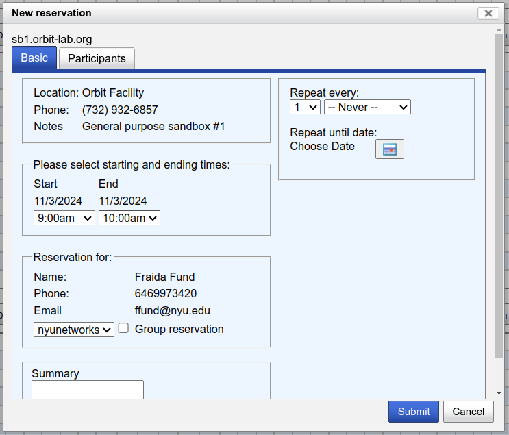

# Hello, COSMOS

COSMOS is a wireless research platform. In this tutorial, you will create an account on ORBIT, practice reserving time on one of its sandboxes, load a disk image onto an ORBIT device, and log in to it.


>[!NOTE] 
>This process has a “human in the loop” approval stage - students will need to wait for ORBIT staff and an instructor or research advisor to approve their request to join an "organization". They should be prepared to start the tutorial, wait for these approvals, and then continue.


## Prepare your workstation 

To use COSMOS, you'll need to prepare your workstation (the laptop or PC you are going to use for your experiments).  You will need a terminal application with SSH to connect to your COSMOS resources. You may use the built-in terminal on Linux or Mac. On Windows, you may use [cmder](https://cmder.app/) or any other terminal application that has an SSH client.


## Create an account on COSMOS

Before you can run an experiment on COSMOS, you will need to:

* create an account
* add SSH keys to your profile
* join a project

#### Create your COSMOS account

First, you will create an account on the ORBIT/COSMOS experiment portal. 

1. Visit [https://www.orbit-lab.org/userManagement/register](https://www.orbit-lab.org/userManagement/register). Fill in your first name, last name, and requested username.
2. For "Email address", you must use your official university email address.
3. For "Organization", you should **NOT** select the name of your school, even if you see it listed! Find our from your instructor or research advisor which "Organization" you should try to join.
4. Add a phone number.
5. In the "Comment" field, you can write e.g. "Run experiments for my class in wireless networks."

Then, submit your request. 

You will need to reply to a confirmation email for your account request - look for an email from accountmanager@orbit-lab.org (check your Spam folder if you don't see it in your inbox)!

You will also need the manager of your "Organization" to approve your request. (This is why it is essential that you select the exact organization that your instructor or research advisor has advised - they will only get your request if you asked to join *their* organization.)

Wait until you receive email notification that your request is approved.

#### Generate SSH keys

Next, you will add SSH keys to your COSMOS profile. You will use these keys when connecting to resources on COSMOS.

> Note: If you already have an SSH key pair, you can use it with COSMOS - copy the contents of the public key, then skip to the "Upload SSH keys to your COSMOS profile" section and continue there. If you don’t already have an SSH key pair, continue with the rest of this section. 

SSH public-key authentication uses a pair of separate keys (i.e., a key pair): one “private” key, which you keep a secret, and the other “public”. A key pair has a special property: any message that is encrypted with your private key can only be decrypted with your public key, and any message that is encrypted with your public key can only be decrypted with your private key. 

This property can be exploited for authenticating login to a remote machine. First, you upload the public key to a special location on the remote machine. Then, when you want to log in to the machine: 

* You use a special argument with your SSH command to let your SSH application know that you are going to use a key, and the location of your private key. If the private key is protected by a passphrase, you may be prompted to enter the passphrase (this is not a password for the remote machine, though).
* The machine you are logging in to will ask your SSH client to “prove” that it owns the (secret) private key that matches an authorized public key. To do this, the machine will send a random message to you.
* Your SSH client will encrypt the random message with the private key and send it back to the remote machine.
* The remote machine will decrypt the message with your public key. If the decrypted message matches the message it sent you, it has “proof” that you are in possession of the private key for that key pair, and will grant you access (without using an account password on the remote machine.)

(Of course, this relies on you keeping your private key a secret.)

We’re going to generate a key pair on our laptop, then upload it to our COSMOS profile.

Open a terminal, and generate a key named `id_rsa_cosmos`:

```
ssh-keygen -t rsa -f ~/.ssh/id_rsa_cosmos
```

Follow the prompts to generate and save the key pair. The output should look something like this: 

```
$ ssh-keygen -t rsa -f ~/.ssh/id_rsa_cosmos
Generating public/private rsa key pair.
Enter file in which to save the key (/users/ffund01/.ssh/id_rsa_cosmos):
Enter passphrase (empty for no passphrase):
Enter same passphrase again: 
Your identification has been saved in /users/ffund01/.ssh/id_rsa_cosmos.
Your public key has been saved in /users/ffund01/.ssh/id_rsa_cosmos.pub.
The key fingerprint is:
SHA256:z1W/psy05g1kyOTL37HzYimECvOtzYdtZcK+8jEGirA ffund01@example.com<br>
The key's randomart image is:
+---[RSA 2048]----+
|                 |
|                 |
|           .  .  |
|          + .. . |
|    .   S .*.o  .|
|     oo. +ooB o .|
|    E .+.ooB+* = |
|      oo+.@+@\.\o|
|        ..o==@ =+|
+----[SHA256]-----+
```

If you use a passphrase, make a note of it somewhere safe! (You don’t have to use a passphrase, though - feel free to leave that empty for no passphrase.)

You will need the contents of your public key in the next step. To see your public key from the terminal, run

```
cat ~/.ssh/id_rsa_cosmos.pub
```

The output will start with `ssh-rsa`, e.g.

```
ssh-rsa AAAAB3NzaC1yc2EAAAADAQABAAABgQDDTquOzOx/1MEMpxnzWWsSZ/TOpbNygzbVViFeoGWXAIY/qkdr7X/Zql9R/hrZU/Podi/U0Q/KbaW5j9gN/cGQ4X8Lo1kc2euMfgfDBaK/GzIIx0ob1LDeWkF1MB2XjtzOHGrjx/lBkRho3eYleJ2D9tdIGZq+aLQU5IZ8m7P5Odigsax+W5YHRIe3A0LYHxQD7gkerkwq7QcGxY9FPDVFG3Ut2i++iydfXL0gdAwVLHWI8g28eDuoAqTbenL/pp//gfA5bBiEbSb59u+kMX+/SPT/WrbGIZEHdAo2kU659/t81IRySdwUGPi3kaLgmjpDvsw9ItQKFeL/Y2hCiQt28x3oe2dAytFvjufRF/oZuSohGF+LbMi9YPkLL+IxGG5+rGucTQcLP7ATObsvqbxVvvr7koiMNJfb1VIgRQmJ4neWCbhKm4XmYo8Edd6A/ogucHrhCzFYSzunhWbYQCXaxPL4Kpu+TBWDVsP0nwSP4VP+8ATEchnCOguPXG8L0UM= ffund@ffund-XPS-13-9300
```


#### Upload SSH keys to your COSMOS profile

Once you have an account, you will log in to the COSMOS experiment portal at [https://wiki.cosmos-lab.org/wiki](https://wiki.cosmos-lab.org/wiki) - click the "Login" button and use your COSMOS username and password.

1. Click "Profile" in the menu near the top right. You will notice some public keys already associated with your account - these are used to move between systems internally on COSMOS. You should never delete these keys.
2. Next to "Public key file", click "Choose file". Select your *public* key (with the `.pub` file extension).
3. You should now see your own key listed in the "SSH Public Keys" table on the top.

## Reserve resources

COSMOS is a time-shared resource. To use the platform,, you must reserve the resources that you want to use in advance. COSMOS has several small testbeds, called "sandboxes" - you reserve an entire sandbox at a time, and then you have exclusive access to that sandbox and its resources for the duration of your reservation. Once your reservation ends, you will be disconnected from your resources.

For our "Hello, COSMOS" experiment, you will need one hour on either sb1 (ORBIT), sb2 (ORBIT), sb3 (ORBIT), or sb7 (ORBIT).

Use the calendar to select an available time. For example, if I want to reserve 9AM on Sunday morning on sb1 (ORBIT), I would click on the corresponding grid: 


A pop-up will load:



In this window, select the end time for your reservation, then click "Submit". 

## Start an experiment

At the beginning of your reservation, you are ready to run an experiment on COSMOS!

Open a terminal. In this terminal, you will SSH to the "Experiment Console" on the sandbox that you have reserved:

```
ssh -i /PATH/TO/KEY USERNAME@SANDBOX.orbit-lab.org
```

for example, if my username is `ffund`, my key is `~/.ssh/id_rsa_cosmos`, and I have reserved `sb1`, I will run

```
ssh -i ~/.ssh/id_rsa_cosmos ffund@sb1.orbit-lab.org
```

When you are logged in, you will see a message saying

```

                              Welcome to
    ___  ____  ____ ___ _____     _        _    ____                  
   / _ \|  _ \| __ )_ _|_   _|   | |      / \  | __ )  ___  _ __ __ _ 
  | | | | |_) |  _ \| |  | |_____| |     / _ \ |  _ \ / _ \| '__/ _` |
  | |_| |  _ <| |_) | |  | |_____| |___ / ___ \| |_) | (_) | | | (_| |
   \___/|_| \_\____/___| |_|     |_____/_/   \_\____(_)___/|_|  \__, |
                                                                |___/ 

```

and your terminal prompt will say: `USERNAME@console`.

Now, we need to load a *disk image* onto our experiment resources. At the console terminal prompt, run

```
omf-5.4 load -i wifi-experiment.ndz -t system:topo:all
```

This will begin a process that - 

* powers off the compute nodes in the sandbox
* boots them using a PXE image over the network
* and then streams an entire disk image over the network, which they should then write to their hard disks.

At the end of this process, the hard disk image should be installed on all nodes on the sandbox. It should say something like

```
 INFO exp:  ----------------------------- 
 INFO exp:  Imaging Process Done 
 INFO exp:  2 nodes successfully imaged - Topology saved in '/tmp/pxe_slice-2024-10-31t18.42.30.274+00.00-topo-success.rb'
 INFO exp:  ----------------------------- 
```

Then, you will turn both nodes on:

```
omf-5.4 tell -a on -t system:topo:all
```

Wait a few minutes for them to boot. Then, from the console, run

```
ssh root@node1-1
```

Your terminal prompt will change to reflect that you are now running commands on "node1-1". We are going to configure "node1-1" as a WiFi access point. At the terminal prompt for "node1-1", run

```
cat > hostapd-hello.conf << EOF
interface=wlan0
driver=nl80211
ssid=hello
hw_mode=g
channel=6
EOF
```

to create the configuration file, then run

```
hostapd -B hostapd-hello.conf
```

to start the access point. You should see  a message

```
wlan0: AP-ENABLED 
```

Also configure an IP address on the wireless interface on "node1-1"; run

```
ip addr add 192.168.0.1/24 dev wlan0
```

Next, run 

```
exit
```

to return to the "console" terminal, and from there, SSH into "node1-2":

```
ssh root@node1-2
```


Your terminal prompt will change to reflect that you are now running commands on "node1-2". We are going to configure "node1-2" as a WiFi client. At the terminal prompt for "node1-2", run


```
ip link set wlan0 up
iwconfig wlan0 mode managed  
iwconfig wlan0 essid "hello"  
```

After a few moments, run

```
iwconfig wlan0  
```

and confirm that it is connected with ESSID "hello".

Configure an IP address on the wireless interface on "node1-2"; run

```
ip addr add 192.168.0.2/24 dev wlan0
```

Then use

```
ping -c 5 192.168.0.1
```

to confirm that you have a connection over the WiFi link.