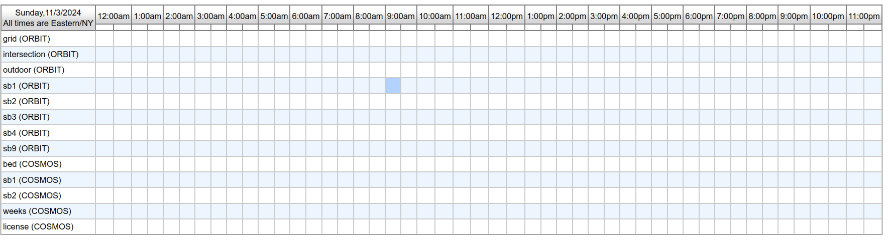
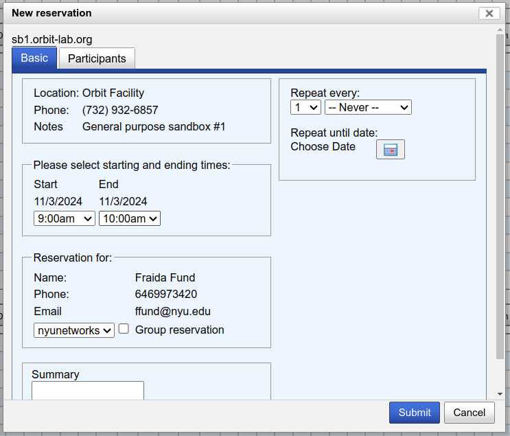

# Hello, COSMOS

<<<<<<< HEAD
COSMOS is a wireless research platform. In this tutorial, you will create an account on ORBIT, practice reserving time on one of its sandboxes, load a disk image onto an ORBIT device, and log in to it.


>[!NOTE] 
>This process has a “human in the loop” approval stage - students will need to wait for ORBIT staff and an instructor or research advisor to approve their request to join an "organization". They should be prepared to start the tutorial, wait for these approvals, and then continue.
=======
COSMOS is a wireless research platform for experiments involving advanced wireless technologies. In this tutorial, you will prepare your workstation, create a COSMOS account, and add an SSH key to your account.

>[!NOTE]
>Before you start, ask your instructor or research advisor for the name of the COSMOS group you should join. You will need to select this group when you register.
>>>>>>> 485374e (Add Hello COSMOS tutorial)


## Prepare your workstation 

<<<<<<< HEAD
To use COSMOS, you'll need to prepare your workstation (the laptop or PC you are going to use for your experiments).  You will need a terminal application with SSH to connect to your COSMOS resources. You may use the built-in terminal on Linux or Mac. On Windows, you may use [cmder](https://cmder.app/) or any other terminal application that has an SSH client.


## Create an account on COSMOS

Before you can run an experiment on COSMOS, you will need to:

* create an account
* add SSH keys to your profile
* join a project

#### Create your COSMOS account

First, you will create an account on the ORBIT/COSMOS experiment portal. 

1. Visit [https://www.orbit-lab.org/userManagement/register](https://www.orbit-lab.org/userManagement/register). Fill in your first name, last name, and requested username.
2. For "Email address", you must use your official university email address.
3. For "Organization", you should **NOT** select the name of your school, even if you see it listed! Find our from your instructor or research advisor which "Organization" you should try to join.
4. Add a phone number.
5. In the "Comment" field, you can write e.g. "Run experiments for my class in wireless networks."

Then, submit your request. 

You will need to reply to a confirmation email for your account request - look for an email from accountmanager@orbit-lab.org (check your Spam folder if you don't see it in your inbox)!

You will also need the manager of your "Organization" to approve your request. (This is why it is essential that you select the exact organization that your instructor or research advisor has advised - they will only get your request if you asked to join *their* organization.)

Wait until you receive email notification that your request is approved.

#### Generate SSH keys

Next, you will add SSH keys to your COSMOS profile. You will use these keys when connecting to resources on COSMOS.

> Note: If you already have an SSH key pair, you can use it with COSMOS - copy the contents of the public key, then skip to the "Upload SSH keys to your COSMOS profile" section and continue there. If you don’t already have an SSH key pair, continue with the rest of this section. 
=======
To use COSMOS, you'll need to prepare your workstation (the laptop or PC you are going to use for your experiments) with a terminal application. You will use SSH from the terminal to connect to your COSMOS resources.

You may use the built-in terminal on Linux or Mac. On Windows 10 or 11, you may use PowerShell, Windows Terminal, or any other terminal application that has an SSH client.

## Create an account on COSMOS

#### Create your COSMOS account

First, you will request an account on the COSMOS portal.

1. Open the [COSMOS user registration form](https://www.cosmos-lab.org/register_usr).
2. Select the group name that your instructor or research advisor gave you.
3. Enter your contact information and choose your mailing list preference.
4. Submit the form.

>[!IMPORTANT]
>Once you fill in the form, you will receive an email to confirm your Account Request. You must open the link in that email within 30 minutes to submit the account creation request. If you do not receive the email, check your spam folder and allow messages from `accountmanager@orbit-lab.org`.

After you confirm your request, the PI for your group must approve it. COSMOS will send you another email when the PI approves your account. You can then log in to the [COSMOS portal](https://www.cosmos-lab.org/portal/).

#### Generate SSH keys

Next, you will generate an SSH key pair. You will add the public key to your COSMOS account, and then you will use these keys when connecting to COSMOS resources.

> Note: If you already have an SSH key pair, you can use it with COSMOS - copy the contents of the public key, then skip to the "Upload your public key to COSMOS" section and continue there. If you don’t already have an SSH key pair, continue with the rest of this section.
>>>>>>> 485374e (Add Hello COSMOS tutorial)

SSH public-key authentication uses a pair of separate keys (i.e., a key pair): one “private” key, which you keep a secret, and the other “public”. A key pair has a special property: any message that is encrypted with your private key can only be decrypted with your public key, and any message that is encrypted with your public key can only be decrypted with your private key. 

This property can be exploited for authenticating login to a remote machine. First, you upload the public key to a special location on the remote machine. Then, when you want to log in to the machine: 

* You use a special argument with your SSH command to let your SSH application know that you are going to use a key, and the location of your private key. If the private key is protected by a passphrase, you may be prompted to enter the passphrase (this is not a password for the remote machine, though).
* The machine you are logging in to will ask your SSH client to “prove” that it owns the (secret) private key that matches an authorized public key. To do this, the machine will send a random message to you.
* Your SSH client will encrypt the random message with the private key and send it back to the remote machine.
* The remote machine will decrypt the message with your public key. If the decrypted message matches the message it sent you, it has “proof” that you are in possession of the private key for that key pair, and will grant you access (without using an account password on the remote machine.)

(Of course, this relies on you keeping your private key a secret.)

We’re going to generate a key pair on our laptop, then upload it to our COSMOS profile.

<<<<<<< HEAD
Open a terminal, and generate a key named `id_rsa_cosmos`:

```
ssh-keygen -t rsa -f ~/.ssh/id_rsa_cosmos
=======
Open a terminal, and generate a key named `id_ed25519_cosmos`:

```
ssh-keygen -t ed25519 -f ~/.ssh/id_ed25519_cosmos
>>>>>>> 485374e (Add Hello COSMOS tutorial)
```

Follow the prompts to generate and save the key pair. The output should look something like this: 

```
<<<<<<< HEAD
$ ssh-keygen -t rsa -f ~/.ssh/id_rsa_cosmos
Generating public/private rsa key pair.
Enter file in which to save the key (/users/ffund01/.ssh/id_rsa_cosmos):
Enter passphrase (empty for no passphrase):
Enter same passphrase again: 
Your identification has been saved in /users/ffund01/.ssh/id_rsa_cosmos.
Your public key has been saved in /users/ffund01/.ssh/id_rsa_cosmos.pub.
The key fingerprint is:
SHA256:z1W/psy05g1kyOTL37HzYimECvOtzYdtZcK+8jEGirA ffund01@example.com<br>
The key's randomart image is:
+---[RSA 2048]----+
|                 |
|                 |
|           .  .  |
|          + .. . |
|    .   S .*.o  .|
|     oo. +ooB o .|
|    E .+.ooB+* = |
|      oo+.@+@\.\o|
|        ..o==@ =+|
=======
$ ssh-keygen -t ed25519 -f ~/.ssh/id_ed25519_cosmos
Generating public/private ed25519 key pair.
Enter file in which to save the key (/users/ffund01/.ssh/id_ed25519_cosmos):
Enter passphrase (empty for no passphrase):
Enter same passphrase again: 
Your identification has been saved in /users/ffund01/.ssh/id_ed25519_cosmos.
Your public key has been saved in /users/ffund01/.ssh/id_ed25519_cosmos.pub.
The key fingerprint is:
SHA256:rYsVy23PwinHQ8GMCbEzy52KTssKnT/RuoMwUt2j8D8 ffund@example.com
The key's randomart image is:
+--[ED25519 256]--+
|      ..         |
|      ..         |
|   . .+. =       |
|  o ..o=oo+      |
| . o oo.S ..     |
|+. .+..o =.      |
|ooo.o+. =+o.     |
| ..=+.Eo.oBo     |
|  ..*+...o oo    |
>>>>>>> 485374e (Add Hello COSMOS tutorial)
+----[SHA256]-----+
```

If you use a passphrase, make a note of it somewhere safe! (You don’t have to use a passphrase, though - feel free to leave that empty for no passphrase.)

You will need the contents of your public key in the next step. To see your public key from the terminal, run

```
<<<<<<< HEAD
cat ~/.ssh/id_rsa_cosmos.pub
```

The output will start with `ssh-rsa`, e.g.

```
ssh-rsa AAAAB3NzaC1yc2EAAAADAQABAAABgQDDTquOzOx/1MEMpxnzWWsSZ/TOpbNygzbVViFeoGWXAIY/qkdr7X/Zql9R/hrZU/Podi/U0Q/KbaW5j9gN/cGQ4X8Lo1kc2euMfgfDBaK/GzIIx0ob1LDeWkF1MB2XjtzOHGrjx/lBkRho3eYleJ2D9tdIGZq+aLQU5IZ8m7P5Odigsax+W5YHRIe3A0LYHxQD7gkerkwq7QcGxY9FPDVFG3Ut2i++iydfXL0gdAwVLHWI8g28eDuoAqTbenL/pp//gfA5bBiEbSb59u+kMX+/SPT/WrbGIZEHdAo2kU659/t81IRySdwUGPi3kaLgmjpDvsw9ItQKFeL/Y2hCiQt28x3oe2dAytFvjufRF/oZuSohGF+LbMi9YPkLL+IxGG5+rGucTQcLP7ATObsvqbxVvvr7koiMNJfb1VIgRQmJ4neWCbhKm4XmYo8Edd6A/ogucHrhCzFYSzunhWbYQCXaxPL4Kpu+TBWDVsP0nwSP4VP+8ATEchnCOguPXG8L0UM= ffund@ffund-XPS-13-9300
```


#### Upload SSH keys to your COSMOS profile

Once you have an account, you will log in to the COSMOS experiment portal at [https://wiki.cosmos-lab.org/wiki](https://wiki.cosmos-lab.org/wiki) - click the "Login" button and use your COSMOS username and password.

1. Click "Profile" in the menu near the top right. You will notice some public keys already associated with your account - these are used to move between systems internally on COSMOS. You should never delete these keys.
2. Next to "Public key file", click "Choose file". Select your *public* key (with the `.pub` file extension).
3. You should now see your own key listed in the "SSH Public Keys" table on the top.

## Reserve resources

COSMOS is a time-shared resource. To use the platform,, you must reserve the resources that you want to use in advance. COSMOS has several small testbeds, called "sandboxes" - you reserve an entire sandbox at a time, and then you have exclusive access to that sandbox and its resources for the duration of your reservation. Once your reservation ends, you will be disconnected from your resources.

For our "Hello, COSMOS" experiment, you will need one hour on either sb1 (ORBIT) or sb3 (ORBIT).

Use the calendar to select an available time. For example, if I want to reserve 9AM on Sunday morning on sb1 (ORBIT), I would click on the corresponding grid: 



A pop-up will load:



In this window, select the end time for your reservation, then click "Submit". 

Depending on the timing of your reservation (less than 12 hours in advance or not),

* your reservation may be approved immediately (and you will get an email notification that it is approved) 
* your reservation may be approved at the beginning of the slot (and you will get an email notification that it is approved) 
* or it may be submitted and "pending", and you will get email notification about approval the day before.

>[!NOTE] 
>It is possible for you or someone else to request a time slot, even if it is "pending" for someone else. In case of a conflict - two users request the same resource at the same time - conflicts will be resolved based on how much time you've already used over the last two weeks. Those who have used less time will be more likely to have their requests approved for conflicting slots. Thus, you should be careful not to reserve time and then let it go unused - any time that you reserve will "count" against you in case of a conflict.


## Start an experiment

At the beginning of your reservation, you are ready to run an experiment on COSMOS!

Open a terminal. In this terminal, you will SSH to the "Experiment Console" on the sandbox that you have reserved:

```
ssh -i /PATH/TO/KEY USERNAME@SANDBOX.orbit-lab.org
```

for example, if my username is `ffund`, my key is `~/.ssh/id_rsa_cosmos`, and I have reserved `sb1`, I will run

```
ssh -i ~/.ssh/id_rsa_cosmos ffund@sb1.orbit-lab.org
```

When you are logged in, you will see a message saying

```

                              Welcome to
    ___  ____  ____ ___ _____     _        _    ____                  
   / _ \|  _ \| __ )_ _|_   _|   | |      / \  | __ )  ___  _ __ __ _ 
  | | | | |_) |  _ \| |  | |_____| |     / _ \ |  _ \ / _ \| '__/ _` |
  | |_| |  _ <| |_) | |  | |_____| |___ / ___ \| |_) | (_) | | | (_| |
   \___/|_| \_\____/___| |_|     |_____/_/   \_\____(_)___/|_|  \__, |
                                                                |___/ 

```

and your terminal prompt will say: `USERNAME@console`.

Now, we need to load a *disk image* onto our experiment resources. At the console terminal prompt, run

```
omf-5.4 load -i wifi-experiment.ndz -t system:topo:all
```

This will begin a process that - 

* powers off the compute nodes in the sandbox
* boots them using a PXE image over the network
* and then streams an entire disk image over the network, which they should then write to their hard disks.

At the end of this process, the hard disk image should be installed on all nodes on the sandbox. It should say something like

```
 INFO exp:  ----------------------------- 
 INFO exp:  Imaging Process Done 
 INFO exp:  2 nodes successfully imaged - Topology saved in '/tmp/pxe_slice-2024-10-31t18.42.30.274+00.00-topo-success.rb'
 INFO exp:  ----------------------------- 
```

Then, you will turn both nodes on:

```
omf-5.4 tell -a on -t system:topo:all
```

Wait a few minutes for them to boot. Then, from the console, run

```
ssh root@node1-1
```

Your terminal prompt will change to reflect that you are now running commands on "node1-1". We are going to configure "node1-1" as a WiFi access point. At the terminal prompt for "node1-1", run

```
cat > hostapd-hello.conf << EOF
interface=wlan0
driver=nl80211
ssid=hello
hw_mode=g
channel=6
EOF
```

to create the configuration file, then run

```
hostapd -B hostapd-hello.conf
```

to start the access point. You should see  a message

```
wlan0: AP-ENABLED 
```

Also configure an IP address on the wireless interface on "node1-1"; run

```
ip addr add 192.168.0.1/24 dev wlan0
```

Next, run 

```
exit
```

to return to the "console" terminal, and from there, SSH into "node1-2":

```
ssh root@node1-2
```


Your terminal prompt will change to reflect that you are now running commands on "node1-2". We are going to configure "node1-2" as a WiFi client. At the terminal prompt for "node1-2", run


```
ip link set wlan0 up
iwconfig wlan0 mode managed  
iwconfig wlan0 essid "hello"  
```

After a few moments, run

```
iwconfig wlan0  
```

and confirm that it is connected with ESSID "hello".

Configure an IP address on the wireless interface on "node1-2"; run

```
ip addr add 192.168.0.2/24 dev wlan0
```

Then use

```
ping -c 5 192.168.0.1
```

to confirm that you have a connection over the WiFi link.
=======
cat ~/.ssh/id_ed25519_cosmos.pub
```

The output will start with `ssh-ed25519`, e.g.

```
ssh-ed25519 AAAAC3NzaC1lZDI1NTE5AAAAIKsJ8MzC+ml/yEWbCsJJOqUENXumlhE+CYOvDkSI/Kk1 ffund@example.com
```

This text string is your public key. You can copy it from the terminal output.


#### Upload your public key to COSMOS

Once you are logged in to the [COSMOS portal](https://www.cosmos-lab.org/portal/),

1. Click your name in the upper-right corner, then select "SSH Keys".
2. Paste the entire contents of `~/.ssh/id_ed25519_cosmos.pub` into the public key field. Make sure that you paste the public key, not the private key.
3. Click "Add Key".
4. Confirm that your key appears in the list of uploaded keys.
## Start an experiment

Now, you are ready to run an experiment on COSMOS!

COSMOS resources are organized into **domains**. Each domain is an isolated environment with its own console, nodes, and control network. COSMOS has several kinds of domains:

* **Top-tier testbeds** support large-scale experiments. These include the outdoor `bed` domain in West Harlem and the indoor `grid` domain at WINLAB. We will not use the grid for this experiment; it is reserved for experiments that need its large-scale deployment.
* **Sandboxes** are small, isolated environments, typically with two nodes and a console. Each sandbox has different radios, compute resources, and other devices. Sandboxes are intended for developing and debugging an experiment before you scale it to a larger testbed.
* **Specialized domains** support work such as outdoor, model-intersection, and private 5G experiments.

You can read more about these environments in the [COSMOS domains guide](https://www.cosmos-lab.org/en/wiki/public/hardware/domains).

In this "Hello, COSMOS" experiment, you will use two nodes in a sandbox to run a basic WiFi experiment. First, you will use the COSMOS Hardware Search to find the sandboxes whose nodes have WiFi interfaces.

### Find a sandbox with WiFi

Log in to the [COSMOS portal](https://www.cosmos-lab.org/portal/), then:

1. Open "Status" in the navigation menu and select "Hardware Search".
2. Under "Wireless / IoT", select "WiFi".
3. Expand the "Domain" filter.
4. Select each sandbox domain: `sb1`, `sb4`, `sb5`, `sb6`, and `sb7`. Leave `grid`, `bed`, and `weeks` unchecked.


The filtered results show WiFi nodes in `sb1`, `sb5`, `sb6`, and `sb7`. For this experiment, create a reservation on **`sb5`, `sb6`, or `sb7`**. These are NJ sandboxes with two WiFi-capable nodes. Do not use `sb1` for this tutorial.

The [COSMOS sandboxes guide](https://www.cosmos-lab.org/wiki/public/hardware/domains/sandboxes) describes the hardware and specialized capabilities of the NJ sandboxes. The hardware inventory and availability can change, so use Hardware Search to check the current options before you make a reservation.

### Reserve a sandbox

Each student should create an **individual two-hour reservation** on `sb5`, `sb6`, or `sb7`.

Open the [COSMOS Scheduler](https://www.cosmos-lab.org/portal/scheduler). The scheduler shows one day at a time. Use the date field in the upper-right corner to move to the day when you plan to run the experiment. The scheduler uses the COSMOS time zone, which is shown above the calendar.


Find the row for `sb5.cosmos-lab.org`, `sb6.cosmos-lab.org`, or `sb7.cosmos-lab.org`. Choose a two-hour period that does not overlap another reservation, then click the grid square at the start of that period. For example, to reserve 2:00-4:00 PM, click the 2:00 PM square.

The "New Reservation" form will open:


1. Confirm that "Resource" shows the sandbox you intended to reserve.
2. Set the start and end date to the same day.
3. Set the end time two hours after the start time. COSMOS limits each reservation request to 120 minutes.
4. For "Summary", enter `Hello COSMOS WiFi experiment`.
5. Leave "Repeat" set to "Does not repeat".
6. Leave "Invite users" empty and leave "Group reservation" unchecked. This is an individual reservation.
7. Click "Create".

After you create the reservation, it appears in yellow while it is pending approval. COSMOS sends reservation updates to the email address associated with your account. An approved reservation appears in dark blue.

COSMOS uses a two-stage approval process. Requests submitted before noon for the following day receive pre-approval that day. Requests submitted less than 12 hours before their start time receive just-in-time approval at the beginning of the reserved time.

You may request a time slot even if another reservation is pending for that slot. The scheduler marks overlapping requests as a conflict and decides which request to approve. COSMOS gives preference to users who have consumed less testbed time during the previous two weeks. Request only the two-hour reservation you need for this experiment, and do not reserve extra slots that you do not expect to use. Using or requesting more testbed time can reduce your chance of approval when your request conflicts with another user's request. Avoid requesting a conflicting slot less than two hours before it starts because the just-in-time process may not resolve that conflict.

The [COSMOS reservation guide](https://www.cosmos-lab.org/wiki/public/getting-started/createres) has more information about reservations, approvals, and conflicts.

## Access your sandbox

Wait until your reservation is approved and its start time has arrived. You cannot access the sandbox console before then.

Open a terminal on your workstation and SSH to the console for your reserved domain. Replace `YOUR_USERNAME` with your COSMOS username and replace `sb6` if you reserved `sb5` or `sb7`:

```bash
# runs on your workstation
ssh -i ~/.ssh/id_ed25519_cosmos YOUR_USERNAME@sb6.cosmos-lab.org
```

The console hostname confirms which domain you have entered:

```console
$ hostname
console.sb6.cosmos-lab.org
```

The console is a shared control machine for the domain. You will use it to image, turn on, and access the two experiment nodes. Do not install experiment software on the console.

### Check the nodes

Run:

```bash
# runs on console
omf stat -t all
```

You should see two nodes. Their initial power state may differ from this example:

```console
$ omf stat -t all
-----------------------------------------------
 Available Nodes (2):
   node1-1.sb6.cosmos-lab.org       POWERON
   node1-2.sb6.cosmos-lab.org       POWERON
-----------------------------------------------
```

### Load a disk image

Load the `ubuntu2404-uhd4.8-gr3.10.ndz` image onto both nodes:

```bash
# runs on console
omf load -i ubuntu2404-uhd4.8-gr3.10.ndz \
  -t node1-1,node1-2
```

Imaging takes several minutes. `omf load` resets the nodes, writes the image, and powers the nodes off when it finishes. A successful run ends with output like this:

```console
Loading disk image onto 2 nodes
   Domain:  sb6.cosmos-lab.org
   Image:   ubuntu2404-uhd4.8-gr3.10.ndz
   Disk:    /dev/sda
   Boot reset timeout: 150s
   Resize:  20 GB (default)
   Disk loading timeout: 800s

Resetting nodes...
Booted 2/2 nodes
Loading image 'ubuntu2404-uhd4.8-gr3.10.ndz' via 224.0.0.5:7170...
Powering off all nodes...

 -----------------------------
 Imaging Process Done
 2 nodes successfully imaged
 -----------------------------
```

Do not interrupt the command while it is writing the image.

### Turn on the nodes

Turn on both nodes:

```bash
# runs on console
omf tell -a on -t node1-1,node1-2
```

Each node should reply `OK`:

```console
-----------------------------------------------
 Node: node1-1.sb6.cosmos-lab.org       Reply: OK
 Node: node1-2.sb6.cosmos-lab.org       Reply: OK
-----------------------------------------------
```

Wait about one minute for the nodes to boot, then check their state:

```bash
# runs on console
omf stat -t all
```

Both nodes should report `POWERON`.

## Configure the WiFi network

You will configure `node1-1` as a WiFi access point named `hello-cosmos` and connect `node1-2` as a client. The two nodes will use static addresses on an isolated `192.168.50.0/24` network.

Open two more terminals on your workstation and SSH to the sandbox console in each. From the first console session, connect to `node1-1`:

```bash
# runs on console
ssh root@node1-1
```

From the second console session, connect to `node1-2`:

```bash
# runs on console
ssh root@node1-2
```

You are now working as `root` on each experiment node. Keep the two terminals separate and check the shell prompt before you run each command.

### Install the WiFi tools

Run these commands on **both nodes**:

```bash
# runs on node1-1 and node1-2
rm -rf /var/lib/apt/lists/*
apt update
apt -y install hostapd wpasupplicant iperf3 rfkill
modprobe ath9k
rfkill unblock wifi
```

The image may contain stale APT indexes, so the first command removes the cached indexes before `apt update` downloads fresh copies.

Confirm that the Atheros WiFi interface is available:

```bash
# runs on node1-1 and node1-2
iw dev
```

Look for the interface listed under `phy#0`. On the tested nodes it is named `wlp3s0`, but the name can differ across hardware or disk images:

```console
phy#0
        Interface wlp3s0
                addr 00:15:6d:84:fb:7a
                type managed
```

### Start the access point on node1-1

In the `node1-1` terminal, create the access point configuration:

> If `iw dev` showed an interface name other than `wlp3s0`, replace `wlp3s0` with that name in the configuration and commands below.

```bash
# runs on node1-1
cat > /tmp/hostapd.conf <<'EOF'
interface=wlp3s0
driver=nl80211
ssid=hello-cosmos
hw_mode=g
channel=11
EOF
```

This tutorial uses an open network inside your isolated sandbox. Do not use an open access point for a production network.

Assign the AP its address and start `hostapd`:

```bash
# runs on node1-1
ip link set wlp3s0 down
ip addr flush dev wlp3s0
ip addr add 192.168.50.1/24 dev wlp3s0
ip link set wlp3s0 up
hostapd -B /tmp/hostapd.conf
```

Confirm the AP state:

```bash
# runs on node1-1
iw dev wlp3s0 info
```

The output should identify the SSID, AP mode, and channel:

```console
Interface wlp3s0
        addr 00:15:6d:84:fb:7a
        ssid hello-cosmos
        type AP
        channel 11 (2462 MHz), width: 20 MHz, center1: 2462 MHz
        txpower 21.00 dBm
```

### Associate node1-2 with the AP

In the `node1-2` terminal, create the client configuration:

> If `iw dev` showed an interface name other than `wlp3s0`, replace `wlp3s0` with that name in the commands below.

```bash
# runs on node1-2
cat > /tmp/wpa_supplicant.conf <<'EOF'
ctrl_interface=/run/wpa_supplicant
network={
    ssid="hello-cosmos"
    key_mgmt=NONE
}
EOF
```

Start the client:

```bash
# runs on node1-2
ip link set wlp3s0 down
ip addr flush dev wlp3s0
ip link set wlp3s0 up
wpa_supplicant -B -i wlp3s0 -c /tmp/wpa_supplicant.conf
```

`wpa_supplicant` now runs in the background. Check its status:

```bash
# runs on node1-2
wpa_cli -i wlp3s0 status
```

The association is ready when the output includes `ssid=hello-cosmos` and `wpa_state=COMPLETED`:

```console
bssid=00:15:6d:84:fb:7a
freq=2462
ssid=hello-cosmos
id=0
mode=station
pairwise_cipher=NONE
group_cipher=NONE
key_mgmt=NONE
wpa_state=COMPLETED
address=00:15:6d:84:fb:6f
```

If the state is `SCANNING` or `ASSOCIATING`, run the status command again. Once the state is `COMPLETED`, assign the client address:

```bash
# runs on node1-2
ip addr add 192.168.50.2/24 dev wlp3s0
```

Then check the association:

```bash
# runs on node1-2
iw dev wlp3s0 link
```

A successful association shows the AP address and SSID:

```console
Connected to 00:15:6d:84:fb:7a (on wlp3s0)
        SSID: hello-cosmos
        freq: 2462.0
        signal: -41 dBm
        tx bitrate: 130.0 MBit/s MCS 15
```

The MAC address, signal level, and bitrate in your output may differ.

## Test the WiFi link

First, send four ICMP echo requests from `node1-2` to the AP:

```bash
# runs on node1-2
ping -c 4 192.168.50.1
```

A working link returns four replies with no packet loss:

```console
PING 192.168.50.1 (192.168.50.1) 56(84) bytes of data.
64 bytes from 192.168.50.1: icmp_seq=1 ttl=64 time=7.92 ms
64 bytes from 192.168.50.1: icmp_seq=2 ttl=64 time=0.885 ms
64 bytes from 192.168.50.1: icmp_seq=3 ttl=64 time=0.852 ms
64 bytes from 192.168.50.1: icmp_seq=4 ttl=64 time=0.918 ms

--- 192.168.50.1 ping statistics ---
4 packets transmitted, 4 received, 0% packet loss
```

The ping test confirms that the two nodes can exchange IP packets over the WiFi network.

### Measure throughput

In the `node1-1` terminal, start an `iperf3` server:

```bash
# runs on node1-1
iperf3 -s
```

Leave it running. In the `node1-2` terminal, send traffic over the WiFi link for five seconds:

```bash
# runs on node1-2
iperf3 -c 192.168.50.1 -t 5
```

The test run produced this summary:

```console
Connecting to host 192.168.50.1, port 5201
[  5] local 192.168.50.2 port 53514 connected to 192.168.50.1 port 5201
[ ID] Interval           Transfer     Bitrate         Retr
[  5]   0.00-5.00   sec  53.6 MBytes  89.9 Mbits/sec    0  sender
[  5]   0.00-5.01   sec  51.4 MBytes  86.1 Mbits/sec       receiver

iperf Done.
```

Your throughput will vary with radio conditions. A completed test with nonzero throughput confirms that application data crossed the WiFi link.
>>>>>>> 485374e (Add Hello COSMOS tutorial)
